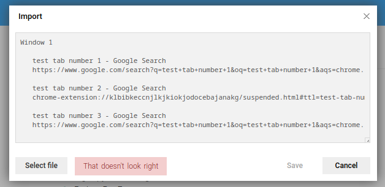
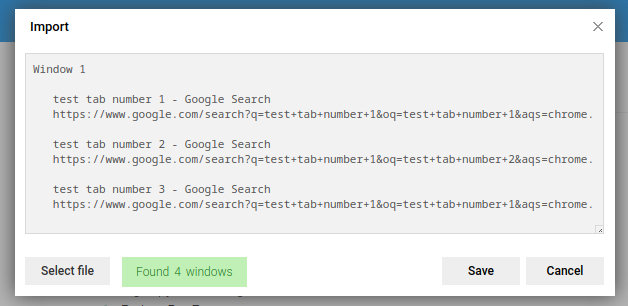

# Session Fixer 

## Description

Session Buddy is a popular Chrome extension that allows to save Chrome sessions to text files so they can be imported again. The import feature is fragile and often is unable to parse the same text file the extension created, mostly when the URL contains a reference to any Chrome extension. 
This script corrects these URLs so that Session Buddy is able to recognise the file while importing.

## Usage

The script takes a session text file path as its only argument and writes a corrected copy of it in the same directory as the input file, with the added `_fixed` suffix to the file name.

`python3 main.py <session_export_text_file>`

### Example

When trying to import a broken session text file in Session Buddy:

After running the script:

`python3 main.py session_buddy_export_2021_02_06_12_32_18.txt`

